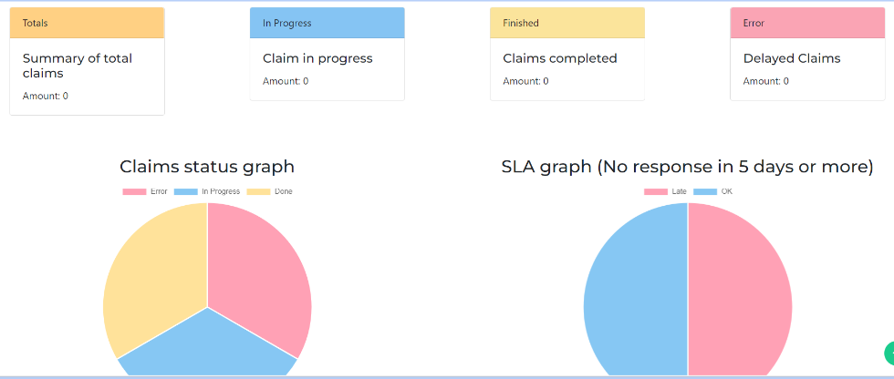

# Angular and Node.js Project Setup

This project showcases the implementation of a comprehensive web application that includes features for rendezvous and time management, as well as a complete complaint management system. The project utilizes the power of Angular for the frontend and Node.js for the backend.

## Project Details

The project aims to provide a user-friendly platform for managing appointments, scheduling meetings, and tracking time effectively. Additionally, it includes a robust complaint management system that allows users to submit and track their complaints, ensuring timely resolution.

## Prerequisites

Before getting started, ensure that you have the following software installed on your system:

- **Node.js**: Visit [Node.js](https://nodejs.org/) and download the latest LTS version for your operating system.

## Project Setup

1. Clone the project repository to your local machine:
git clone <repository_url>

2. Navigate to the project directory:
cd <project_directory>

3. Install the project dependencies:
npm install

## Running the Application

To run the application, follow these steps:

1. Open a terminal and navigate to the project directory.

2. Start the Angular frontend development server:
ng serve

3. Open another terminal window/tab and navigate to the project directory.

4. Start the Node.js backend server:
node server.js

5. Access the application in your web browser:
http://localhost:4200
